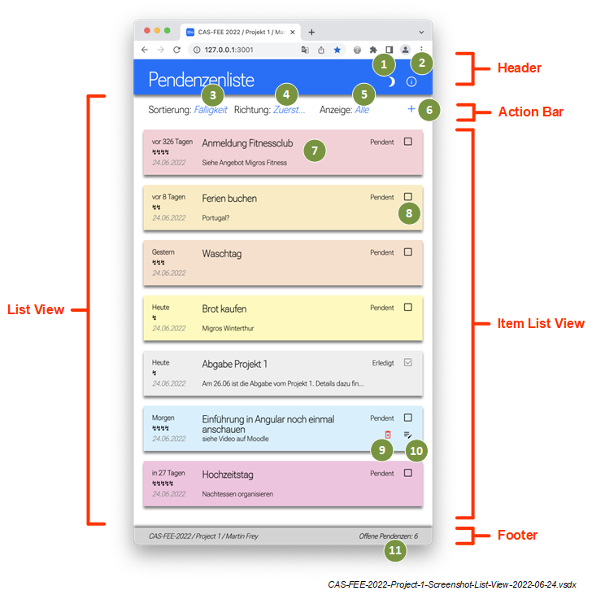
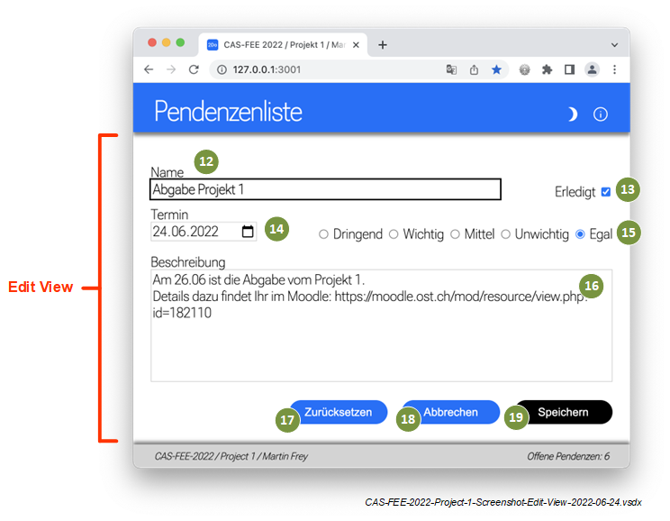
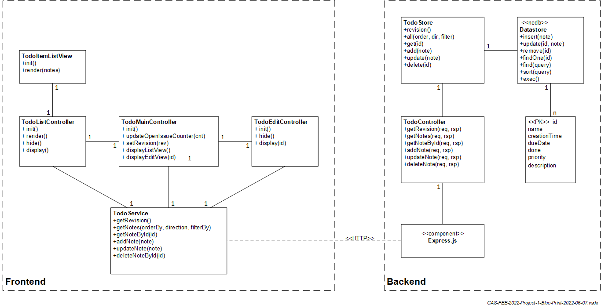

CAS FEE 2022 / Martin Frey / 2022-06-25

# Project 1: Todo-App

1. [Leistungsmerkmale](#Leistungsmerkmale)
2. [Bedienoberfläche](#Bedienoberfläche)
3. [Implementierung](#Implementierung)
4. [Umgebung](#Umgebung)
5. [Inbetriebnahme](#Inbetriebnahme)

## Example
## Example2
## Third Example

## Leistungsmerkmale

Die aktuelle Version unterstützt folgende Funktionen:
1) Neue Pendenz erstellen
2) Pendenz anpassen, inkl. überprüfung der Benutzereingabe und rückgängig machen von Änderungen
3) Pendenz löschen
4) Pendenzen auf- und absteigend sortieren:
   - Priorität
   - Fälligkeit
   - Name
   - Erstellung
5) Pendenzen filtern:
   - alle
   - offen
   - überfällig
6) Umschaltung Hell-/Dunkel-Design
7) Infodialog
8) Anzeige der Anzahl offenen Pendenzen
9) Persistente Speicherung der Pendenzen auf dem Backend
10) Gleichzeitiger Zugriff mehrere Browser-Sessions, inkl. automatischer Datensynchronisation
11) Anzeige von Systemfehlern

Folgende Funktionen stehen nicht zur Verfügung:
- Benutzermanagement
- Bedienungshilfen (barrierefreier Betrieb)
- Unterstützung für verschiedene Gerätetypen (z.B. Smartphone)
- Abspeichern der Benutzereinstellungen auf dem Client
- Unterstützung für mehrere Sprachen und Regionen
- HTTPS
- ...

## Bedienoberfläche

### List View

Header, Action-Bar und Footer werden fix dargestellt, für die Pendenzen wird eine Scrollliste eingesetzt.

1) Umschaltung Tag-/Nachtansicht
2) Info-Dialog
3) Selektion Sortierkriterium
4) Selektion Sortierrichtung (Auf- oder Absteigend)
5) Selektion Filterkriterium
6) Neue Pendenz erstellen
7) Listendarstellung für Pendenz (Hintergrundfarbe wird durch Prio, Status und Fokus bestimmt)
8) Pendenz Erledigen (Pedenz kann nur in Edit-View erneut eröffnet werden)
9) Pendenz Löschen (wird ausschliesslich während Fokus angezeigt)
10) Pendenz Editieren (wird ausschliesslich während Fokus angezeigt)
11) Anzeige der offenen Pendenzen

### Edit View

12) Eingabe Pendenzenname, 
    Eingabefeld muss zwingend ausgefüllt werden, 
    sonst erscheint eine Fehlermeldung und das Abspeichern ist nicht möglich
13) Pendenz schliessen (erledigt) oder erneut öffnen
14) Eingabe Erledigungstermin
15) Eingabe der Priorität
16) Beschreibungstext
17) Verwerfen der Änderungen, d.h. es werden die Daten der bereits bestehenden Pendenz verwendet,
    für eine neue Pendez werden die Standardwerte verwendet
18) Zurück zur Liste-View, ohne die Änderungen zu speichern
19) Speichern der Änderung und zurück zur List-View

## Implementierung

## Umgebung 

Die Applikation wurde auf folgenden Plattformen und Browserversionen getestet:

| Plattform    | Browser               |
|--------------|-----------------------|
| macos 11.6.5 | Safari 15.4           |
| macos 11.6.5 | Chrome 102.0.5005.115 |
| macos 11.6.5 | Firefox  101.0.1      |

## Inbetriebnahme

| Befehl            | Beschreibung                                  |
|-------------------|-----------------------------------------------|
| npm run stylelint | Testet ob die CSS Files in Ordnung sind.      |
| npm run w3c       | Testet ob die HTML Files in Ordnung sind.     |
| npm run eslint    | Testet ob die JS Files in Ordnung sind.       |
| npm run all       | Führt die Tests für CSS/HTML/JS aus.          |
| npm run start     | Started den Web-Server: http://localhost:3001 |
